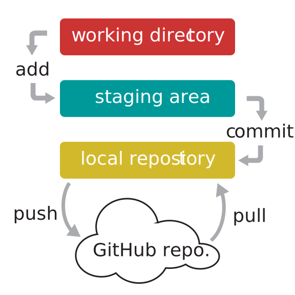

This document is based on a presentation I did for the grad student organization for the Department of Integrative Biology, UW--Madison in Fall 2017.
I've made a few changes to hopefully make it more transparent as a stand-alone document.


## Why use git and GitHub?

<div>

</div>

- To avoid the situation above!
- Collaborating with a team
- Sharing code with strangers
- Tracing and avoiding horrible mistakes


## git and GitHub overview


```{r github-overview-fig, fig.width = 4, echo = FALSE}

```


- The "working directory" is the folder containing the actual files you're interacting 
  with.
- After you save changes to the working directory that you want to keep, you must
  then add these changes to the "staging area" using `git add`.
- The staging area is where you temporarily store changes you might want to eventually 
  add to your "local repository". It's very easy to remove these changes from
  the staging area before any future steps because they're not yet in the repository.
- Once you're satisfied with the changes that you've added to the staging area, you
  add this set of changes to the local repository by using `git commit`.
- The local repository stores the history of this directory as you've chronicled
  using git.
- Each commit can be thought of as a snapshot of the directory, where you control what's
  being looked at.
- Your control comes in when you decide what changes to add to the staging area before
  committing. This can be really useful for keeping changes in the same commit if they 
  are from the same section of a program or set of analyses.
- To update a "GitHub repository" based on some changes you've made and committed
  in your local repository, you push them to GitHub using `git push`.
- To update your local repository based on some changes someone else has made, committed,
  and pushed to the GitHub repository, you pull them to your local repository
  using `git pull`.


## Prerequisites

- [git](https://git-scm.com/downloads)
- [GitHub account](https://github.com)
- [R](https://cloud.r-project.org/)
- [RStudio](https://www.rstudio.com/products/rstudio/download/)


## Today's goals

1. Tell git who you are
2. Connect securely to GitHub
3. Create a test repository
4. Clone, commit, and push your repository


### 1. Telling git who you are

In RStudio, `Tools` > `Shell...`

Set global defaults for name and email.
Make sure the email below is the one you use for your GitHub account


```bash
git config --global user.name 'John Doe'
git config --global user.email 'john@doe.com'
```

__Verifying that above worked by checking global git options\:__

Output from this command...

```bash
git config --global --list
```
... should include this:

```bash
user.name=John Doe
user.email=john@doe.com
```


### 2. Connecting securely to GitHub using SSH

First, check if you already have an SSH key

From R:

```r
file.exists("~/.ssh/id_rsa.pub")
# Windows:
# file.exists("C:/Users/USERNAME/.ssh/id_rsa")
```

If `FALSE`, you need to make a public key first...

#### 2.1 Making and viewing key


<small>(image from `https://r-pkgs.org/git.html#git-setup`)</small>

* Click "View public key" to see if you have one yet.
* If not, then generate one by clicking "Create RSA Key..." (you don't generally need a
  passphrase).
* Click "View public key" and copy the key for the next step.

#### 2.2 Adding key to GitHub

Login to `github.com` in web browser

Go to `https://github.com/settings/ssh`


Enter a descriptive title (e.g., "Personal MacBook Pro")

Paste your key into the "Key" box


### 3. Create a test repository

#### 3.1 Initiate new repository


From <code>github.com</code>, hit "New repository":


From profile page, hit "New":


#### 3.2 Describe and create new repository

If you want to actually use this repository for existing files, replace 
`awesome_name` with something useful.


<span style="color: red;font-weight: bold;">\*</span>
If not using R, leave at "None" or change to language you're using


### 4. Clone, commit, and push your repository

#### 4.1 Clone repository in RStudio

`File` > `New Project` > `Version Control` > `Git`


Replace `lucasnell` with your GitHub username, and `awesome_name` with your repository's
name.

#### 4.2 Make local changes

If just using a test repo, edit the `README.md` file and save changes.

If wanting to move a directory over to GitHub, copy those files into the 
new repository's folder


#### 4.3 Commit and Push


1. In RStudio, under the "Git" tab, checked "Staged" for file(s) that you changed or
   added
2. Hit "Commit"
3. Add useful commit message
4. Hit "Commit" again
5. Hit "Push"

If the above works, then you're successfully using GitHub through RStudio


## Additional resources

- Source of info for much of this presentation: `happygitwithr.com`
- GitHub Education (for free private repos): `education.github.com`
- Simple command line guide: `rogerdudler.github.io/git-guide`
- Recommended git clients (RStudio isn't great to use long-term)
    - GitKraken: `gitkraken.com`
    - SourceTree: `sourcetreeapp.com`
- This presentation is available at `lucasnell.com/github_gsis`
- My email: `lucas@lucasnell.com`
